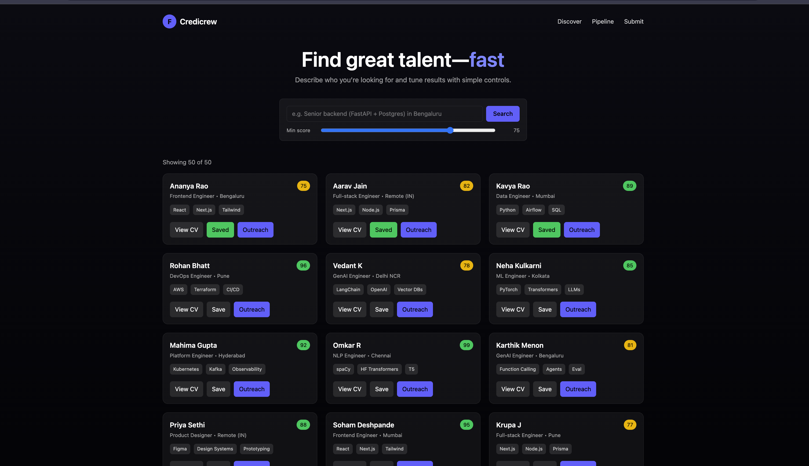
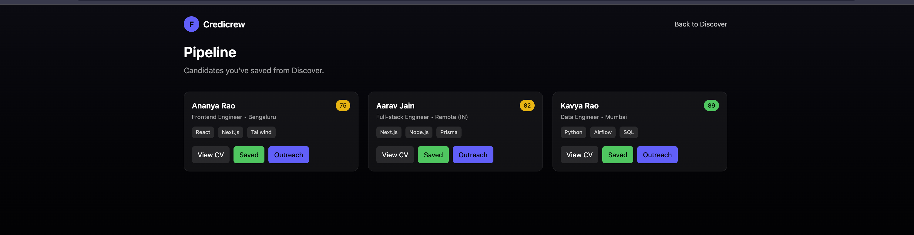

# 🚀 Credicrew

Credicrew is a modern recruitment and talent discovery platform.  
It helps companies **discover, filter, and manage candidates** with a sleek **Next.js + Tailwind frontend** and a **FastAPI backend**.

---

## ✨ Features
- 🔎 **Search & Filter** candidates by role, skills, and score  
- 🌗 **Dark/Light theme toggle**  
- 💾 **Save candidates** to a pipeline for later  
- 📄 **View candidate CVs** on a dedicated profile page  
- ➕ **Submit new candidates** directly via the platform  

---

## 🖼 Screenshots

### Discover Page


### Pipeline Page


### Candidate CV Page


---

## 🛠 Tech Stack
- **Frontend:** Next.js 14, TypeScript, TailwindCSS  
- **Backend:** FastAPI (Python)  
- **Database:** SQLite / PostgreSQL  
- **Styling:** TailwindCSS with dark/light theme  

---

## ⚡ Getting Started

```bash
# Clone the repo
git clone <your-repo-url>
cd Credicrew

# --- Backend setup ---
cd backend
python -m venv .venv
source .venv/bin/activate   # (use .venv\Scripts\activate on Windows)
pip install -r requirements.txt
uvicorn main:app --reload

# --- Frontend setup ---
cd ../frontend
npm install
npm run dev

📌 Project Structure

Credicrew/
 ├── backend/      # FastAPI backend
 ├── frontend/     # Next.js + Tailwind frontend
 ├── docs/         # Documentation
 ├── ml/           # Machine learning experiments
 ├── README.md     # Project readme
 ├── Credicrew_1.png
 ├── Credicrew_2.png
 ├── Credicrew_3.png


🤝 Contributing

Pull requests are welcome! For major changes, open an issue first to discuss what you’d like to change.

MIT License © 2025 Credicrew