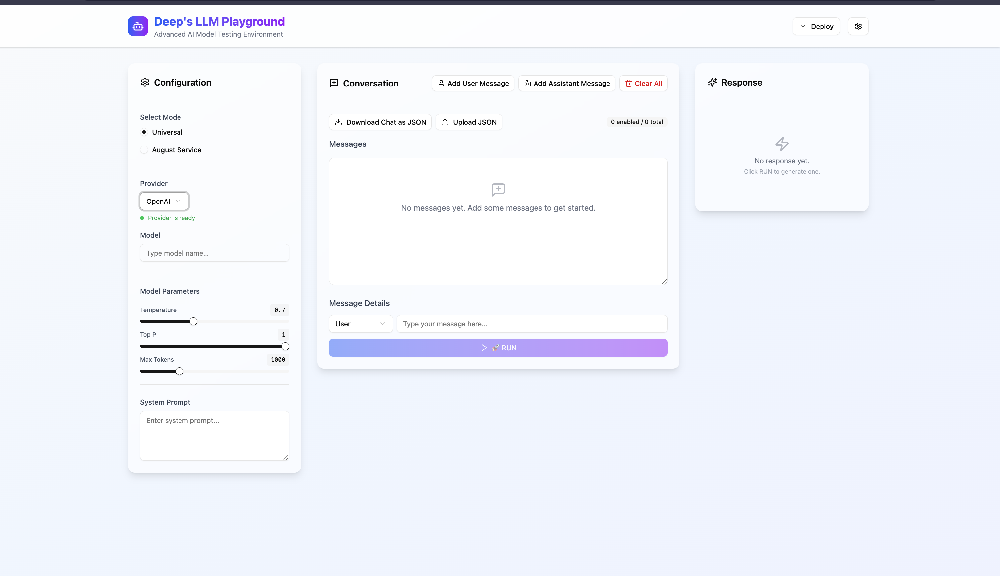

# LLM Playground

An advanced AI model testing playground to experiment with multiple LLM providers (OpenAI, Anthropic, etc.) in a unified interface.

## 🚀 Features
- Universal mode & custom August API mode
- JSON upload/download for conversations
- Adjustable parameters (temperature, top-p, max tokens)
- System prompt injection
- Clean UI built with React + Tailwind

## 🖼️ Screenshots


## ⚙️ Setup
1. Clone the repo:
   ```bash
   git clone https://github.com/Aryanharitsa/Projects.git
   cd Projects/LLM_Playground