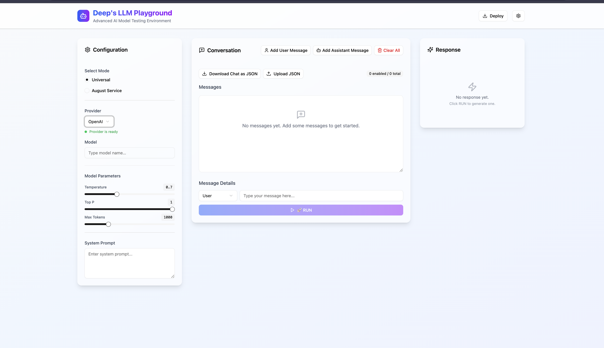

# 🧪 LLM Playground

A side‑by‑side LLM evaluation studio. Run the **same prompt** against
multiple frontier models in parallel and see who wins on **speed**,
**cost**, and **content** — all in one view.

Built with a Flask backend and a React + Tailwind + shadcn/ui frontend.

---

## ✨ What's new — LLM‑as‑Judge auto‑eval

> One prompt → N answers → an LLM judge scores them all.

The Arena now ranks responses on **quality**, not just speed and cost. After
a run, hit **Judge responses** and another model scores every candidate
against a 5‑criterion rubric (Correctness · Completeness · Clarity ·
Conciseness · Format) on a 1‑5 scale. Per‑criterion bars, a 0‑100 weighted
composite, a one‑sentence rationale, a leaderboard, and a 🏅 *judge pick*
badge — all rendered in the same panel.

- **Editable rubric**: add/remove criteria, tweak weights live (auto‑renormalised).
- **Pick the judge**: any provider/model in your keychain — Claude judging GPT,
  Gemini judging Claude, etc.
- **Robust JSON extraction**: tolerates ```json fences, leading prose, missing
  candidates; clamps every score to the rubric range so a misbehaving judge
  can't poison the UI.
- **Cost & latency of judgement** shown next to the leaderboard.
- **Winner ring**: each card now shows a conic‑gradient score ring; the
  judge's #1 gets an amber ring + 🏅 badge.
- **Export includes the verdict**: the JSON download now bundles
  `judge: { rubric, verdicts, leaderboard, judge: {...} }`.

> Composite formula: `Σᵢ ((scoreᵢ − 1) / 4) · weightᵢ` × 100, where weights
> are renormalised to sum to 1 before scoring.

### Round‑1 — Arena mode (still here)

- **Parallel fan‑out** to OpenAI, Anthropic, Google (up to 6 candidates).
- **Per‑card metrics**: latency · total tokens · estimated **$ cost**.
- **Surface‑metric badges**: 🏆 fastest · 💰 cheapest · 📝 most verbose.
- **Headline tiles**: models tested, successes, wall‑clock runtime, total spend.
- **One‑click copy** per response.
- Shared system prompt + parameters across every candidate.

Under the hood `/api/compare` runs each provider in a `ThreadPoolExecutor`
and catches per‑candidate errors so a missing API key never kills the
siblings; `/api/judge` wraps a single judge call around the same provider
stack and returns parsed verdicts + a leaderboard.

---

## 🚀 Everything else

- **Universal mode** — classic chat against a single provider/model with
  conversation editing, message toggling, duplicate, reorder, "run from
  here" branching, system prompt dialog, reasoning‑effort presets for
  o‑series / opus models, drag‑and‑drop JSON import.
- **August mode** — forward payloads to a custom `August` service
  (`pkey` / `pvariables`).
- **API key manager** — masked key status per provider, in‑app save
  writing to the backend `.env`.
- **Full debug panel** — provider, model, input/output/total tokens,
  latency, request id, status, timestamp, cost.
- **Cost estimate on every single‑chat call** (not just Arena).

## 🖼️ Screenshots



## ⚙️ Setup

```bash
# 1. Clone and enter
git clone https://github.com/Aryanharitsa/Projects.git
cd Projects/LLM_Playground

# 2. Backend
cd llm_playground_backend
python3 -m venv .venv && source .venv/bin/activate
pip install -r requirements.txt
# create a .env with the keys you have (any subset works):
#   OPENAI_API_KEY=...
#   ANTHROPIC_API_KEY=...
#   GEMINI_API_KEY=...
#   AUGUST_API_BASE_URL=...    # optional
#   AUGUST_API_KEY=...         # optional
python src/main.py              # serves on :5050

# 3. Frontend (in a second terminal)
cd ../llm_playground_frontend
pnpm install                    # or npm install
pnpm dev                        # Vite on :5173
```

Open `http://localhost:5173`, pick **Arena** in the sidebar, add 2–6
candidates, type a prompt, hit **Run Arena**.

## 🗺 API surface

| Method | Path                   | Purpose                                                |
|--------|------------------------|--------------------------------------------------------|
| GET    | `/api/health`          | liveness probe                                         |
| GET    | `/api/providers`       | provider → availability + known models                 |
| GET    | `/api/models/:provider`| model list (dynamic when provider supports listing)    |
| GET    | `/api/parameters/:prov`| supported params + `supports_json_mode` / `…reasoning…` |
| GET    | `/api/pricing`         | per‑model input/output $/1M token table                |
| GET    | `/api/rubric`          | default judge rubric (criteria + weights)              |
| POST   | `/api/chat`            | single‑provider chat (returns `cost_usd` in debug)     |
| POST   | `/api/compare`         | **Arena** — parallel fan‑out, winners, total cost      |
| POST   | `/api/judge`           | **LLM‑as‑judge** — score Arena responses with rubric   |
| POST   | `/api/export`          | canonicalise a chat session as JSON                    |
| GET    | `/api/key-status`      | masked key presence per provider                       |
| POST   | `/api/save-keys`       | persist keys to `.env`                                 |

## 📂 Project structure

```
LLM_Playground/
├── llm_playground_backend/
│   └── src/
│       ├── main.py                  # Flask app + CORS + static host
│       ├── pricing.py               # per-model $/1M token table
│       ├── judge.py                 # rubric + LLM-as-judge engine + JSON parser
│       ├── routes/
│       │   ├── llm.py               # /chat, /compare, /judge, /rubric, /pricing, …
│       │   ├── keys.py              # /key-status, /save-keys
│       │   └── user.py
│       ├── providers/               # OpenAI / Anthropic / Gemini / August
│       └── models/
└── llm_playground_frontend/
    ├── src/
    │   ├── App.jsx                  # Universal + August + Arena modes
    │   ├── services/api.js          # typed client, compare + pricing
    │   └── components/ui/           # shadcn primitives
    └── vite.config.js
```

## 🛤 Roadmap

- Response streaming (SSE) with live tokens/sec per card
- Blind A/B voting → ELO leaderboard across saved runs
- Prompt library with diff'd versions
- ~~Auto‑eval rubrics (LLM‑as‑judge) with exportable scoring sheets~~ ✅ shipped
- Persisted judged runs as a queryable history (next move)
- Multi‑judge consensus (run K judges, average scores, surface disagreement)

## 👨‍💻 Author

Built with ❤️ by Aryan D Haritsa · Student @ PES University · AI &
Full‑stack enthusiast.
