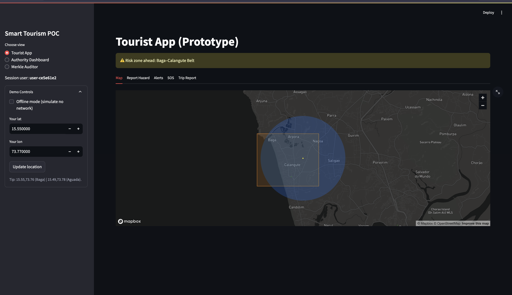
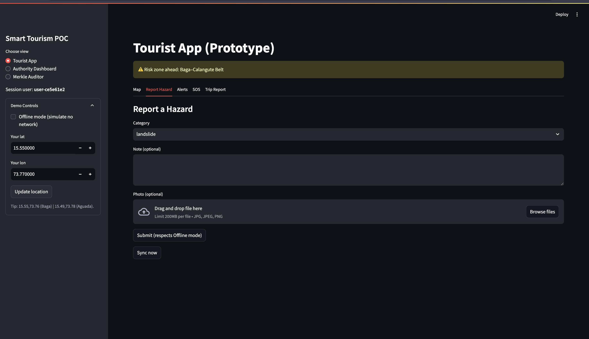
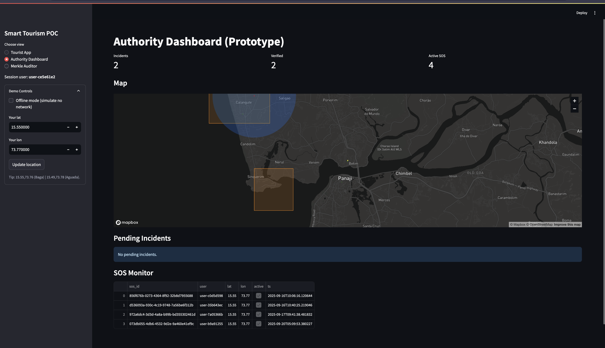

# 🚦 WaySafe

WaySafe is a **Streamlit-powered Smart Navigation & Incident Management System** designed to make travel safer and smarter.  
It integrates real-time data, incident reporting, and optimized routing into a simple, interactive web dashboard.

---

## 🌟 Features

- 📍 **Incident Reporting**  
  Users can submit accident reports, unsafe areas, or traffic disruptions directly into the system.

- 🗺 **Smart Navigation**  
  Displays safe travel routes with contextual safety scores, incident heatmaps, and high-risk zone warnings.

- 📊 **Data Visualization**  
  Interactive maps and charts powered by Streamlit to analyze safety incidents over time.

- 🔔 **Real-Time Updates**  
  Instant reflection of submitted data without needing a page reload.

- ⚡ **Lightweight & Fast**  
  Built with Python and Streamlit – easy to run, extend, and deploy.

---

## 📸 Screenshots

### Dashboard Overview


### Submit Incident Form


### Route Analysis & Safety Insights


---

## ⚙️ Installation & Setup

1. **Clone the repository**
   ```bash
   git clone https://github.com/Aryanharitsa/Projects.git
   cd Projects/WaySafe

## ⚙️ Create Virtual Environment :

    python3 -m venv .venv
    source .venv/bin/activate

## Install Dependencies and run :

    pip install -r requirements.txt
    streamlit run app.py

## 📂 Project Structure :

    WaySafe/
│── app.py              # Main Streamlit app
│── utils.py            # Helper functions
│── data/               # Data storage folder
│── requirements.txt    # Dependencies
│── README.md           # Project documentation
│── WaySafe_1.png       # Screenshot 1
│── WaySafe_2.png       # Screenshot 2
│── WaySafe_3.png       # Screenshot 3


## 🚀 Future Enhancements
	•	🔗 Integration with live traffic APIs
	•	🛰 Geolocation-based user alerts
	•	🤖 AI-powered incident prediction

## 👨‍💻 Author

Built with ❤️ by Aryan D Haritsa
Student @ PES University | Entrepreneur | AI , Full Stack and research Enthusiast
